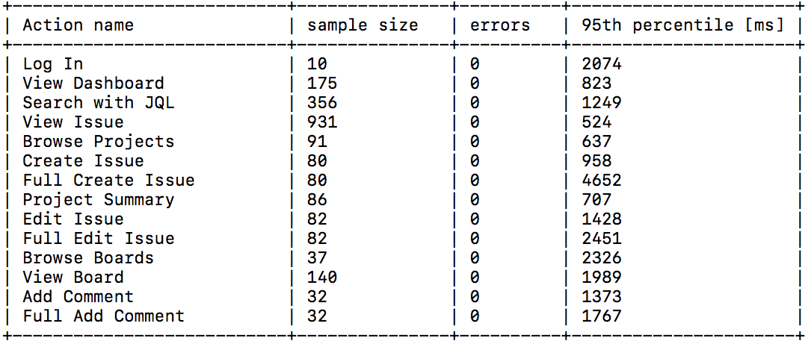

# Benchmark your Jira

[JPT](../../README.md) helps measure the performance impact of a change on your instance.

## Requirements

 - Test environment (Jira versions from 7.2.0 upwards)
 - [Google Chrome](https://www.google.com/chrome/) 62-65
 - [JDK](http://openjdk.java.net/) 8 - 11
 - [Git](https://git-scm.com/)

## How to start 

### Setup of your instance

Benchmarks can alter the data on your Jira, so we recommend a dedicated pre-production environment.
You'll get the most relevant results if you make it as similar to production as possible. As a starting point,
we recommend effectively copying production, which includes the hardware, software and data.

The testing process, through interacting with your instance will make the following changes:

1. Globally disable the Rich Text Editor.
2. Affect the browse history of the tested user (recent issues, recent boards, current JQL search).
3. Affect data displayed by the Activity Stream.
4. Create roughly 4 issues per minute, which means roughly 80 issues (with default load settings).
5. Create roughly 2 comments per minute, which means roughly 30 comments (with default load settings).
6. Load caches and generate resources for visited pages.

The above factors may or may not influence subsequent test results. Depending on actual conditions 400 issues may be negligible to data already contained on the instance. Data growth not exceeding 0.5% can safely be considered negligible.

For most relevant results, it is advised to roll back these changes. In order to be able to reason from the results, always start the test from the same initial conditions. Preparation of the instance prior to each benchmark should include, but not necessarily be limited to:

1. restoring data on the instance,
2. restarting Jira.
   
### Run the benchmark

1. Clone the repository
   
    ```
     git clone https://bitbucket.org/atlassian/jira-performance-tests.git
    ```
    
2. Run the benchmark (**incomplete**)

3. Wait for the test to complete, it will take roughly 20 minutes

    JPT will log a simplified report at the end of the test run. You can check:

     - how many actions have been executed
     - how many errors occurred
     - what's the 95th percentile of action's duration 

    

    The test will also generate a detailed report (**incomplete** example) and a chart (**incomplete** example)

4. Restore the previous instance state 

5. Make a change

6. Run the benchmark again

7. Compare results (**incomplete**)

## Diagnose errors

It is very likely that you'll see that some actions are failing. For each error, you should find an error log message.
Logs are pointing to HTML dump and screenshot.

### Known issues:

1. Issue create/edit screen lacks a required field
2. A required field has a custom validator
3. Virtual users do not understand a required field type

All the above problems have the same origin and the same workarounds. Virtual user can't proceed with action if a real user can't.
A virtual user also does not know customisations. There are three ways to resolve the problem:
- change the configuration

    For example, add a required field.
    
- modify Scenario to skip problematic project/issue

    Look at the Scenario implementations. They contain Actions. Memories share state between actions.
    You can write own Memory implementation, which omits problematic issues/projects.

- implement custom actions that have better knowledge about your instance's customisations
    
    Similarly to the above, you can always create a custom action, which takes care of all the customisations in your Jira instance.  
 

The list describes issues we identified while testing JPT on our internal instances.
If you have a different problem or you don't know how to proceed with the above,
please [contact us](https://ecosystem.atlassian.net/secure/CreateIssue.jspa?issuetype=1&pid=28139).  